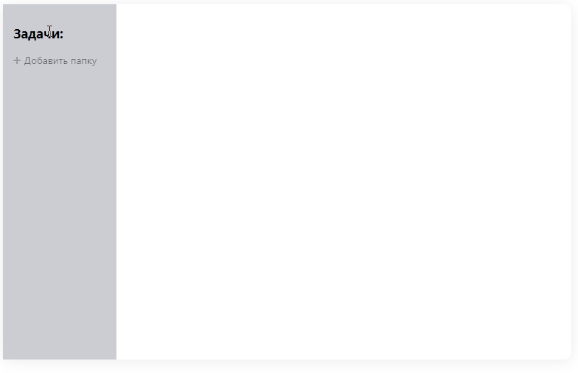

# Реакт Заметки

### [Демо](https://alpatov-react-notes.herokuapp.com/)

## Описание

Вы можете создавать папки с заметками, а так же менять все задачи в них



Для того чтобы запустить приложение нужно открыть консоль разработчика и ввести

```
    $ cd ./ProjectFolder
    $ npm i
    $ npm start
```
